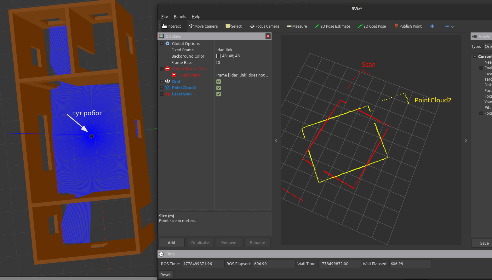

Установил ROS2 и Gazebo. Теперь надо восстановить проект.
Добавил sdf робота. Теперь надо восстановить воркспейс и Лабу 1. И сделаай репозиторий

# Лаба 1

## Описание файла-плагина `wheel_robot_controller`
Этот плагин берет на себя роль "моста" между ROS2 и физическим движком Gazebo. Он:
1. **Слушает** команды скорости из ROS2 (`/cmd_vel`)
2. **Применяет** эти скорости к колесам в симуляции
3. **Сообщает** обратно в ROS2 текущее состояние колес (`/joint_states`)
### 1. Инициализация (Load)
```cpp
void Load (gazebo::physics::ModelPtr model, sdf::ElementPtr sdf) override
```

Это первая функция, которая вызывается при загрузке плагина в Gazebo:
- Создает ROS2 узел для коммуникации
- Находит в модели сочленения (joints) колес по именам `"right_wheel_joint"` и `"left_wheel_joint"`
- Создает подписчик на топик `/cmd_vel` (сюда другие ноды будут отправлять команды)
- Создает публикатор для топика `/joint_states` (сюда будет отправлять состояние колес)
- Запускает таймер, который каждые 100мс будет публиковать состояние
### 2. Обработка команд скорости (cmd_vel_callback)
```cpp
void cmd_vel_callback(const geometry_msgs::msg::Twist& msg)
```
Это сердце управления. Сюда приходят сообщения типа `Twist`, которые содержат:
- `linear.x` - линейная скорость (м/с) - вперед/назад
- `angular.z` - угловая скорость (рад/с) - поворот вокруг вертикальной оси
### 3. Применение скоростей в симуляции
```cpp
joint_right->SetParam("fmax", 0, 100.0);  // Максимальный момент
joint_right->SetParam("vel", 0, v_right); // Желаемая скорость
```

Эти команды говорят физическому движку Gazebo:
- `"fmax"` - какой максимальный крутящий момент можно приложить (100 Н·м)
- `"vel"` - какую угловую скорость нужно поддерживать

### 4. Обратная связь (timer_callback)
Каждые 100мс плагин публикует в топик `/joint_states`:
- Текущие углы поворота колес (в радианах)
- Текущие скорости вращения колес (рад/с)
Это позволяет другим ROS2 нодам (например, для одометрии или визуализации в RViz) знать реальное состояние колес в симуляции.


Добавляем плагин в sdf
```xml
<plugin name = "wheel_robot_controller" filename = "/home/misha/Documents/navigation_ws/install/test_robot_plugin/lib/libwheel_robot_controller.so">
</plugin>
```


Ееее...робот едет, теперь надо сделать ноду для клавиатуры и ноду для телеметрии.


## Описание ноды для клавиатуры `robot_teleop_node`

Необходимо установить библиотеку libevdev
```bash
sudo apt install libevdev-dev
```

Посмотреть устройства, подключенные к компу
```bash
ls /dev/input/by-path/
```
Разрешить доступ к клавиатуре 
```bash
sudo chmod 777 /dev/input/by-path/pci-0000:00:14.0-usb-0:1:1.0-event-kbd
```

Это **нода телеоперации с клавиатуры для ROS2**, которая напрямую читает события с устройства ввода Linux (клавиатуры) с помощью библиотеки `libevdev`. Нода читает нажатия клавиш напрямую с клавиатуры (через файл устройства `/dev/input/...`), преобразует их в команды скорости и публикует в топик `/cmd_vel` для управления роботом.

# Лаба 2
тут промежуточный этап, пока никакого алгоритма сопоставления нет, просто конвертация скана в поинтклауд2
	